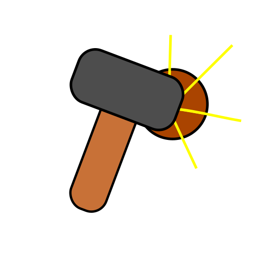

# dimineral  

Dimineral is a web game about managing a mining colony.

Dimineral is powered via [Typescript](https://typescriptlang.org) and [Vite](https://vitejs.dev)

## Running

1. Install at least Node.JS v16 (NVM works)
2. Clone this repo
3. Install all the dependencies
4. `npm run build` or `npm run dev`

## License

All code is hosted under the [MIT license](https://opensource.org/licenses/MIT)

All assets (textures, sounds, etc) are hosted under the CC-BY-SA 3.0 license unless stated otherwise.
